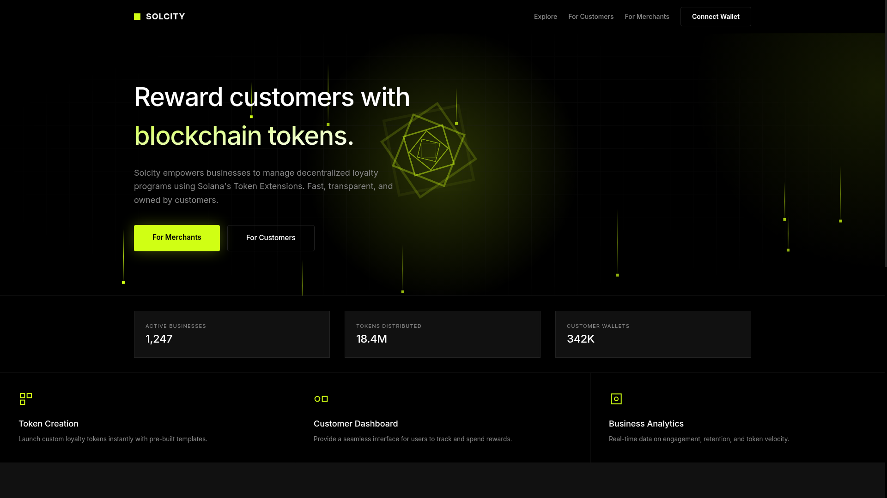
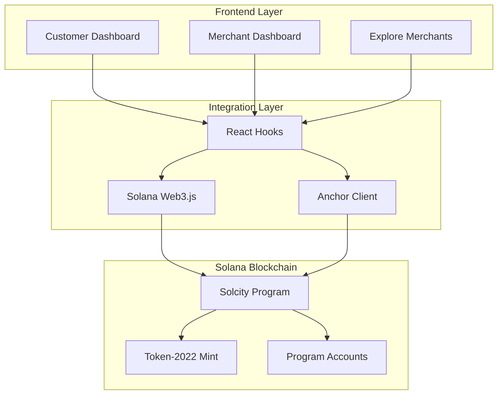
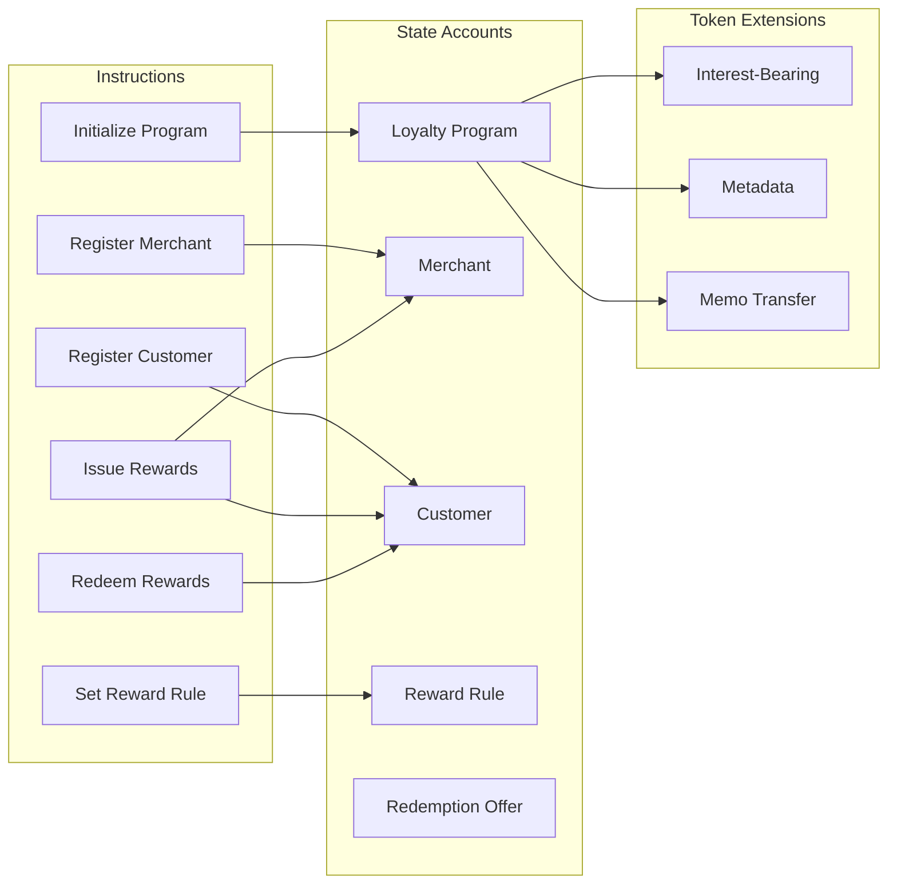
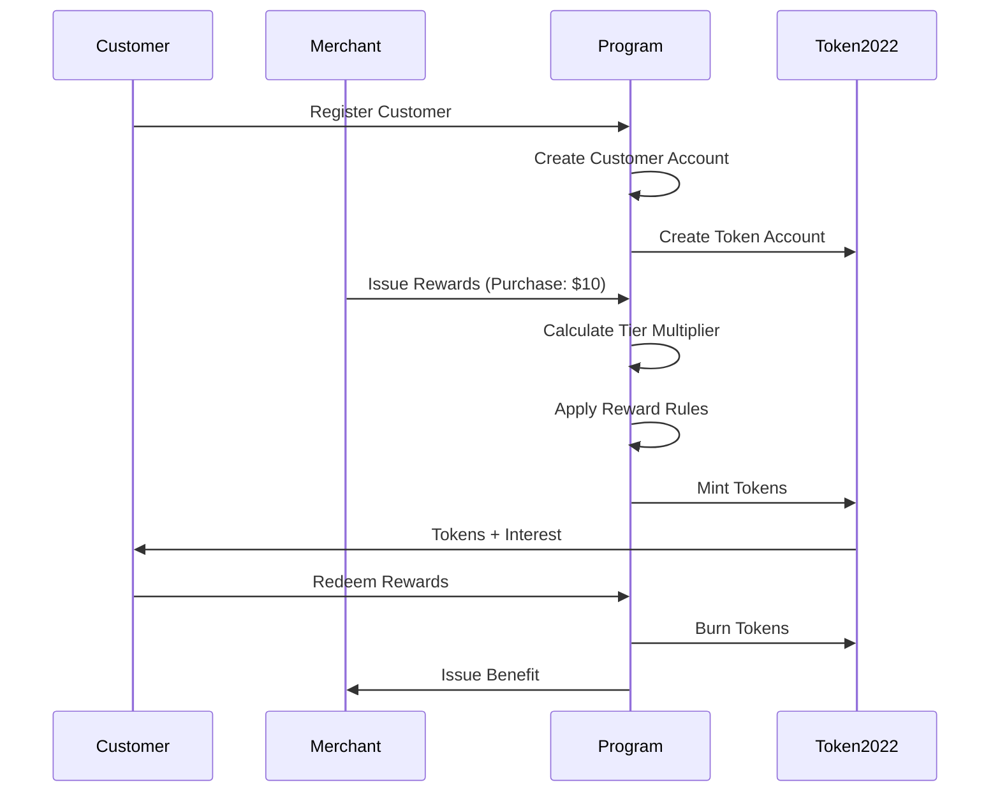

# Solcity - Decentralized Loyalty Program on Solana

<div align="center">



**A decentralized customer loyalty platform built on Solana that enables businesses to create, distribute, and manage loyalty reward tokens using Solana's Token Extensions.**

[](https://solana.com)
[](https://www.anchor-lang.com/)
[](https://nextjs.org/)
[](https://www.typescriptlang.org/)

[Live Demo](https://solcityy.vercel.app) • [Video Demo](https://youtu.be/OwbO2uYSvQs) • [GitHub](https://github.com/Quiflern/Solcity) • [Features](#features) • [Getting Started](#getting-started) • [Documentation](#documentation)

</div>

---

## Overview

Solcity revolutionizes customer loyalty programs by leveraging blockchain technology to create transparent, interoperable, and value-appreciating reward tokens. Unlike traditional loyalty programs where points are siloed and opaque, Solcity tokens are:

- **Growing**: Tokens appreciate over time using Token-2022's Interest-Bearing extension
- **Transparent**: All rules and transactions are on-chain and verifiable
- **Interoperable**: Single wallet holds tokens from all participating merchants
- **Instant**: Earn and redeem rewards in seconds with Solana's 400ms finality
- **Low-Cost**: Near-zero transaction fees make micro-rewards viable

---

## Demo

🎥 **[Watch the Video Demo](https://youtu.be/OwbO2uYSvQs)** - See Solcity in action!

The video walkthrough demonstrates:
- Customer registration and earning rewards
- Merchant dashboard and reward issuance
- Tier progression and multipliers
- Redemption offers and voucher system
- Real-time analytics and transaction tracking

🌐 **[Try the Live App](https://solcityy.vercel.app)** - Experience it yourself on Solana Devnet

---

## Features

### For Customers
- **Tier System**: Progress through Bronze → Silver → Gold → Platinum tiers with increasing reward multipliers
- **Interest-Bearing Tokens**: Your loyalty tokens grow over time (5% APY default)
- **Single Wallet**: Manage all loyalty programs in one place
- **Instant Rewards**: Earn tokens immediately upon purchase
- **Flexible Redemption**: Redeem for discounts, products, cashback, or exclusive access
- **Digital Vouchers**: Receive QR-coded vouchers when redeeming offers
- **Real-Time Dashboard**: Track earnings, growth, tier progress, and active vouchers

### For Merchants
- **Easy Setup**: Register and start issuing rewards in minutes
- **Flexible Rules**: Create bonus multipliers, time-limited promotions, and custom reward logic
- **Analytics Dashboard**: Track customer engagement, token issuance, and voucher metrics
- **Voucher Management**: View, track, and update status of customer vouchers
- **Cost-Effective**: Solana's low fees (~$0.00025 per transaction)
- **Customizable**: Set your own reward rates and redemption offers
- **Transparent**: All transactions are verifiable on-chain

### Technical Features
- **Token-2022 Extensions**:
  - Interest-Bearing: Tokens grow over time
  - Metadata: Store program info on-chain
  - Memo Transfer: Track purchase context
- **Tier-Based Multipliers**: Automatic tier upgrades based on lifetime earnings
- **On-Chain Rules Engine**: Configurable reward rules and bonus multipliers
- **Digital Voucher System**: QR-coded vouchers with unique redemption codes
- **Voucher Status Management**: Track active, used, expired, and revoked vouchers
- **Event Emission**: Track all activities for analytics and integrations

---

## Architecture

### System Overview



### Program Architecture



### Data Flow



---

## Getting Started

### Prerequisites

- **Node.js** 18+ and **Bun** (or npm/yarn)
- **Rust** 1.70+ and **Anchor** 0.30+
- **Solana CLI** 1.18+
- A Solana wallet (Phantom, Solflare, etc.)

### Installation

1. **Clone the repository**
   ```bash
   git clone https://github.com/Quiflern/Solcity.git
   cd Solcity
   ```

2. **Install Solana Program dependencies**
   ```bash
   cd solcity-protocol
   anchor build
   ```

3. **Run tests**
   ```bash
   anchor test
   ```

4. **Deploy to devnet**
   ```bash
   anchor deploy --provider.cluster devnet
   ```

5. **Install Web App dependencies**
   ```bash
   cd ../solcity-web
   bun install
   ```

6. **Configure environment**
   ```bash
   cp .env.example .env.local
   ```
   
   Edit `.env.local`:
   ```env
   NEXT_PUBLIC_SOLANA_CLUSTER=devnet
   NEXT_PUBLIC_RPC_ENDPOINT=https://api.devnet.solana.com
   ```

7. **Run the development server**
   ```bash
   bun run dev
   ```

8. **Open your browser**
   Navigate to [http://localhost:3000](http://localhost:3000)

---

## Project Structure

```
solcity/
├── solcity-protocol/          # Anchor program (Rust)
│   ├── programs/
│   │   └── solcity-protocol/
│   │       └── src/
│   │           ├── lib.rs                    # Program entry
│   │           ├── constants.rs              # Tier thresholds
│   │           ├── errors.rs                 # Custom errors
│   │           ├── events.rs                 # Event definitions
│   │           ├── state/                    # Account structures
│   │           │   ├── loyalty_program.rs
│   │           │   ├── merchant.rs
│   │           │   ├── customer.rs
│   │           │   └── reward_rule.rs
│   │           └── instructions/             # Program instructions
│   │               ├── initialize_program.rs
│   │               ├── register_merchant.rs
│   │               ├── register_customer.rs
│   │               ├── issue_rewards.rs
│   │               ├── redeem_rewards.rs
│   │               └── set_reward_rule.rs
│   ├── tests/                 # Comprehensive test suite
│   └── Anchor.toml
│
├── solcity-web/               # Next.js frontend
│   ├── app/                   # App router pages
│   │   ├── page.tsx           # Landing page
│   │   ├── customer/          # Customer dashboard
│   │   ├── merchant/          # Merchant dashboard
│   │   └── explore/           # Merchant discovery
│   ├── components/            # React components
│   │   ├── auth/
│   │   ├── landing/
│   │   ├── layout/
│   │   ├── providers/
│   │   ├── ui/
│   │   └── wallet/
│   ├── hooks/                 # Custom React hooks
│   │   ├── customer/
│   │   ├── merchant/
│   │   ├── offers/
│   │   ├── program/
│   │   └── wallet/
│   ├── lib/                   # Utilities and config
│   │   ├── anchor/            # Anchor program integration
│   │   │   ├── pdas.ts        # PDA derivation functions
│   │   │   ├── setup.ts       # Program initialization
│   │   │   ├── idl/           # Program IDL
│   │   │   └── types/         # TypeScript types
│   │   ├── explorer.ts        # Solana Explorer URLs
│   │   ├── tiers.ts           # Tier calculation utilities
│   │   └── utils.ts           # General utilities
│   └── package.json
│
└── design-ref/                # Design documentation
    ├── PROGRAM_SUMMARY.md
    ├── IMPLEMENTATION_PLAN.md
    └── project.md
```

---

## Tier System

Customers automatically progress through tiers based on lifetime token earnings:

| Tier | Threshold | Multiplier | Benefits |
|------|-----------|------------|----------|
| **Bronze** | 0 - 999 tokens | 1.0x | Base rewards |
| **Silver** | 1,000 - 9,999 tokens | 1.25x | 25% bonus on all rewards |
| **Gold** | 10,000 - 49,999 tokens | 1.5x | 50% bonus on all rewards |
| **Platinum** | 50,000+ tokens | 2.0x | 100% bonus on all rewards |

**Example**: A Silver tier customer making a $10 purchase at a merchant with 10 tokens/$1 rate:
- Base reward: 10 × 10 = 100 tokens
- Silver multiplier: 100 × 1.25 = **125 tokens earned**

---

## Token-2022 Extensions

Solcity leverages Solana's Token-2022 program extensions:

### 1. Interest-Bearing Extension
```rust
// Tokens grow over time at 5% APY (configurable)
interest_rate: 500 // basis points (5%)
```
**Benefit**: Rewards appreciate automatically, incentivizing long-term holding

### 2. Metadata Extension
```rust
// Store program info on-chain
name: "Solcity Loyalty Token"
symbol: "SLCY"
uri: "https://solcity.io/metadata"
```
**Benefit**: Rich token information visible in wallets and explorers

### 3. Memo Transfer Extension
```rust
// Track purchase context
memo: "Purchase #12345 at Store Location A"
```
**Benefit**: Enhanced analytics and transaction tracking

---

## Usage Examples

### For Customers

1. **Connect Wallet**
   - Visit [https://solcityy.vercel.app](https://solcityy.vercel.app)
   - Click "Connect Wallet" and select your Solana wallet

2. **Register as Customer**
   - Navigate to Customer Dashboard
   - Click "Register" (one-time, creates your customer account)

3. **Earn Rewards**
   - Make purchases at participating merchants
   - Tokens are automatically minted to your wallet
   - Watch your balance grow with interest!

4. **Redeem Rewards**
   - Browse redemption offers
   - Select an offer and confirm redemption
   - Receive digital voucher with QR code
   - Present voucher to merchant for benefit
   - Track voucher status in your profile

### For Merchants

1. **Register Your Business**
   - Navigate to Merchant Dashboard
   - Fill in business details and reward rate
   - Pay one-time registration fee

2. **Issue Rewards**
   - Enter customer wallet address
   - Enter purchase amount
   - Tokens are minted with tier multipliers applied

3. **Create Reward Rules**
   - Set up bonus multipliers (e.g., 2x weekends)
   - Configure time-limited promotions
   - Create first-purchase bonuses

4. **Manage Offers**
   - Create redemption offers
   - Set token costs and quantities
   - Toggle offers active/inactive

5. **Manage Vouchers**
   - View all issued vouchers
   - Search and filter by status
   - Mark vouchers as used
   - Revoke or reactivate vouchers

---

## Testing

### Run Protocol Tests
```bash
cd solcity-protocol
anchor test
```

### Test Coverage
- Program initialization
- Merchant registration
- Customer registration
- Reward issuance with tier multipliers
- Redemption flow with voucher creation
- Voucher status management
- Tier upgrades
- Reward rules
- Error handling

### Run Frontend Tests
```bash
cd solcity-web
bun test
```

---

## Deployment

### Deploy to Devnet
```bash
cd solcity-protocol
anchor deploy --provider.cluster devnet
```

### Deploy to Mainnet
```bash
# Update Anchor.toml cluster to mainnet
anchor deploy --provider.cluster mainnet
```

### Deploy Frontend
```bash
cd solcity-web
bun run build
# Deploy to Vercel, Netlify, or your preferred hosting
```

---

## Documentation

- **[Protocol README](solcity-protocol/README.md)**: Anchor program documentation
- **[Web App README](solcity-web/README.md)**: Frontend documentation

### API Documentation

All hooks and utilities are fully documented with JSDoc comments. Key modules:

- **Hooks**: `solcity-web/hooks/` - React hooks for program interaction
- **PDAs**: `solcity-web/lib/anchor/pdas.ts` - PDA derivation functions
- **Tiers**: `solcity-web/lib/tiers.ts` - Tier calculation utilities
- **Explorer**: `solcity-web/lib/explorer.ts` - Solana Explorer URL generation

---

## Contributing

We welcome contributions! Please follow these steps:

1. Fork the repository
2. Create a feature branch (`git checkout -b feature/amazing-feature`)
3. Commit your changes (`git commit -m 'Add amazing feature'`)
4. Push to the branch (`git push origin feature/amazing-feature`)
5. Open a Pull Request

### Development Guidelines

- Follow existing code style and conventions
- Add tests for new features
- Update documentation as needed
- Ensure all tests pass before submitting PR

---

## Performance

- **Transaction Cost**: ~0.0005 SOL per transaction
- **Account Rent**: ~0.002 SOL per account
- **Finality**: 400ms (Solana's block time)
- **Throughput**: 65,000 TPS (Solana's capacity)

---

## License

This project is licensed under the MIT License - see the [LICENSE](LICENSE) file for details.

---

## Acknowledgments

- Built with [Anchor Framework](https://www.anchor-lang.com/)
- Powered by [Solana](https://solana.com)
- UI components from [shadcn/ui](https://ui.shadcn.com/)
- Icons from [Lucide](https://lucide.dev/)

---

<div align="center">

**Built with love on Solana**

[Back to Top](#solcity---decentralized-loyalty-program-on-solana)

</div>
